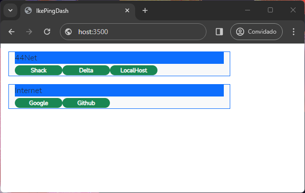
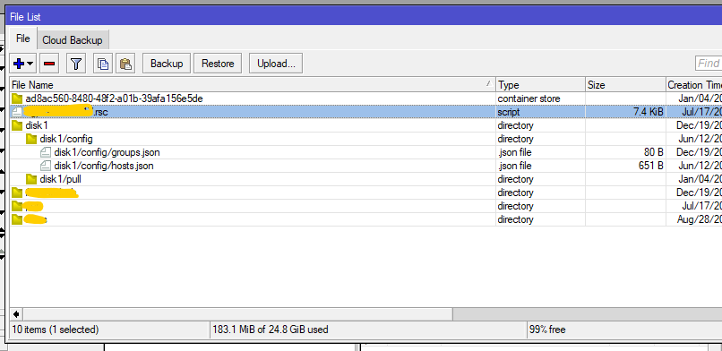
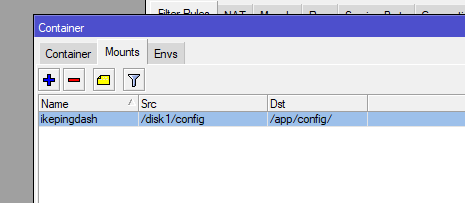
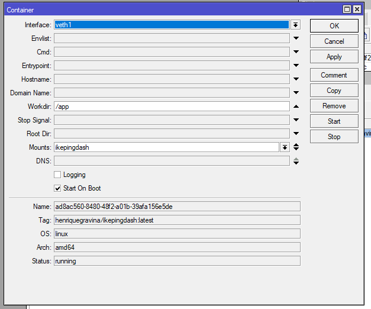

# IkePingDash

This is a simple JS app to monitor if some hosts are UP by ping them.
Its possible to create group of hosts like Server, Networks etc... and
every 30 seconds a ping is sent to each host.

If the host respond to the ping it´s label goes green, if not goes red.

<p>

To use:

```sh
git clone https://github.com/Henriquegravina/IkePingDash.git
cd IkePingDash
npm install
node IkePingDash.js
```

Service will be up on http://ip-addr:3500/

Add Dockerfile to build a docker image:

```
docker build --tag pingdash .
```

To run with external config dir:

```
docker run --publish 3500:3500 -v ./config/:/app/config pingdash
```

if you want to run the image from Docker Hub:

```
docker run --publish 3500:3500 -v ./config/:/app/config henriquegravina/ikepingdash
```

To use this on a Microtik container is very simple ( Testes on CHR Version 7.15 ):


Upload the config files:
<p>

Create the Mount point:
<p>

Add the cointainer:
<p>

At the end don´t forget to adjust the firewall settings 


